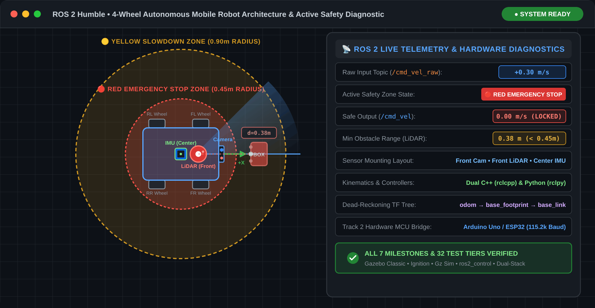
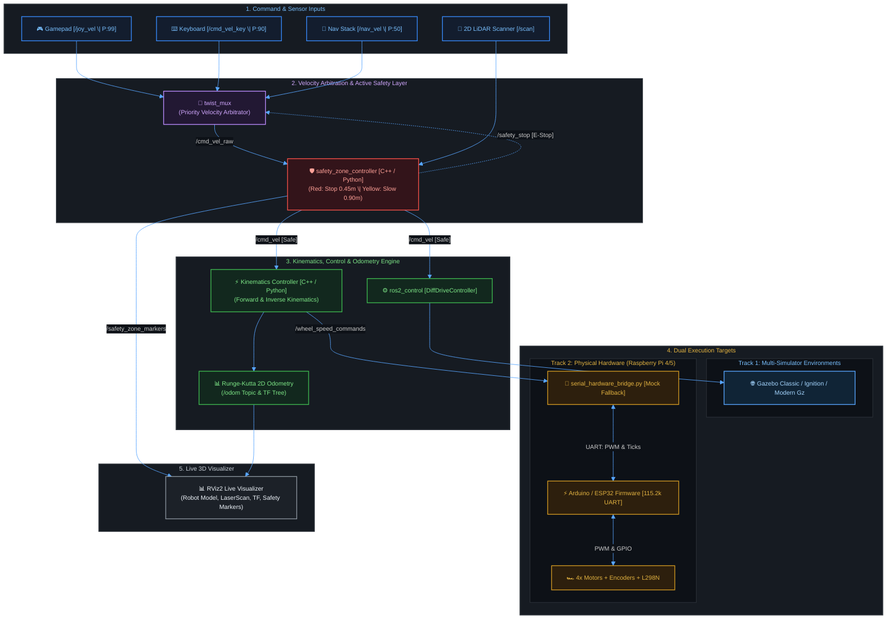

# 🤖 ROS2 Mobile Robot Masterclass


> A complete, production-grade ROS 2 Humble curriculum and 4-wheel autonomous mobile robot (AMR) capstone system, engineered side-by-side in both Python (`rclpy`) and Modern C++ (`rclcpp`), featuring multi-simulator portability (Gazebo Classic, Ignition Gazebo, Modern Gz), active LiDAR collision avoidance, velocity multiplexing (`twist_mux`), and physical microcontroller firmware (Arduino Uno & ESP32).

<div align="center">
  
</div>

### ⚡ 60-Second TL;DR Quickstart

```bash
# 1. Clone & enter workspace
git clone https://github.com/rahul-r-joshua/ROS2-Mobile-Robot-Masterclass.git ~/ros2_mobile_robot_ws && cd ~/ros2_mobile_robot_ws

# 2. Install dependencies & build
bash scripts/install_ros2_dependencies.sh && bash scripts/build_all.sh

# 3. Launch full master simulation (RViz + Gazebo + Active Safety Zones + Teleop)
source install/setup.bash && ros2 launch mobile_robot_bringup simulate_robot.launch.py
```

---

## 📌 Table of Contents
- [Project Overview](#project-overview)
- [System Architecture](#system-architecture)
- [Repository & Workspace Structure](#workspace-structure)
- [Prerequisites](#prerequisites)
- [Installation & Repository Setup](#installation-and-setup)
- [Automated Scripts & Utilities Reference](#automated-scripts-reference)
- [Track 1: Simulation & Autonomous Control](#track-1-simulation)
  - [Milestone 1: 3D URDF & Robot Mechanical Model](#milestone-1)
  - [Milestone 2: Differential Drive Kinematics & Controllers (C++ & Python)](#milestone-2)
  - [Milestone 3: Teleoperation, Twist Mux & Joystick Failsafe](#milestone-3)
  - [Milestone 4: Active LiDAR Safety Zones & Collision Avoidance (C++ & Python)](#milestone-4)
  - [Milestone 5: Master Single-Command Simulation Bringup](#milestone-5)
- [Track 2: Embedded Firmware & Physical Hardware](#track-2-hardware)
  - [Milestone 6: Microcontroller Firmware & Serial Hardware Bridge](#milestone-6)
  - [Milestone 7: Real Robot Hardware Bringup on Raspberry Pi](#milestone-7)
  - [📦 Physical Robot Bill of Materials (BOM) & Components List](src/Readme.md#bill-of-materials)
  - [🔌 4 Complete Hardware Wiring Schematics (Arduino & ESP32)](src/Readme.md#wiring-diagrams)
  - [🍓 Raspberry Pi 4 / 5 Onboard Hardware & OS Setup Guide](src/Readme.md#raspberry-pi-setup)
- [Complete 7-Milestone Curriculum Matrix](#curriculum-matrix)
- [Multi-Simulator & Multi-Controller Matrix (18 Configurations)](#simulator-matrix)
- [Track 2: Hardware Microcontroller Matrix](#microcontroller-matrix)
- [Automated Master Test Suite](#automated-test-suite)
- [🛠️ Track 1: Simulation Troubleshooting Guide](src/Readme.md#troubleshooting-simulation)
- [🔌 Track 2: Embedded Hardware & Serial Troubleshooting Matrix](src/Readme.md#troubleshooting-hardware)
- [Frequently Asked Questions (FAQ)](#faq)
- [Author, Maintainer & Support](#author-and-support)

---

## <a id="project-overview" name="project-overview"></a>🦾 Project Overview

This repository provides an end-to-end robotics learning platform and reference implementation for ROS 2 Humble. It systematically guides developers from core 3D mechanical robot modelling (URDF, Xacro, Gazebo physics, and sensors) through mathematical kinematics (forward, inverse, and Runge-Kutta odometry integration), prioritized velocity routing (`twist_mux` with joystick deadman and keyboard), active LiDAR collision avoidance with RViz safety zones, staged master simulation bringup, to real-world embedded firmware deployment on Arduino Uno and ESP32 with physical Raspberry Pi onboard execution.

### Key Highlights:

* ⚡ **Dual-Stack Python & Modern C++**: Every single controller, kinematics engine, and active safety zone node implemented in both Python (`rclpy`) and Modern C++ (`rclcpp`) side-by-side.
* 🌐 **Multi-Simulator Portability**: Native support across **Gazebo Classic 11**, **Ignition Gazebo (Fortress)**, and **Modern Gazebo (Gz Sim)** using a unified URDF/Xacro description with zero manual switching.
* 🛡️ **Active LiDAR Safety Zones**: Real-time laser point projection into robot base coordinates featuring an auto-reversing **$0.45\text{m}$ Red Emergency Stop Zone** and **$0.90\text{m}$ Yellow 2x Slowdown Zone** with non-blinking RViz2 marker cylinders.
* 🔀 **Prioritized Velocity Multiplexing**: Seamless priority arbitration between Autonomous Navigation, Gamepad Teleop with Deadman failsafe (LB Button), Keyboard teleop, and Emergency Latch locks via `twist_mux`.
* 🔌 **Track 2 Embedded Microcontroller Firmware**: Complete, ready-to-flash firmware sketches for **Arduino Uno** and **ESP32** (supporting both Quadrature Encoders and Open-Loop chassis kits) with a bidirectional **Serial Hardware Bridge** featuring **Seamless Mock Fallback**.
* 🧪 **1-Click Live Verification**: Automated 32-tier master test suite (`python3 scripts/verify_all_lessons.py`) verifying all 7 milestones, 18 simulator configurations, and hardware UART telemetry across live DDS processes.

---

## <a id="system-architecture" name="system-architecture"></a>🏗️ System Architecture



---

## <a id="workspace-structure" name="workspace-structure"></a>📁 Repository & Workspace Structure

```text
ros2_mobile_robot_ws/
├── assets/
│   ├── simulation_demo.gif                # Active LiDAR Safety Zone & Odometry Live Demo (GIF)
│   └── simulation_demo.svg                # Vector Diagram Source (SVG)
├── scripts/
│   ├── build_all.sh                       # Topological colcon build & environment setup
│   ├── clean_build.sh                     # Full cache purge (build/install/log) & clean build
│   ├── clean_simulation.sh                # Gazebo process kill, FastDDS /dev/shm purge & daemon restart
│   ├── install_ros2_dependencies.sh       # Apt dependencies, Gazebo, ros2_control & rosdep install
│   ├── setup_environment.sh               # Sets ROS_DOMAIN_ID=0, ROS_LOCALHOST_ONLY=1 & overlay source
│   ├── test_mobile_robot_ws.py            # Granular milestone/hardware/sim tester CLI
│   └── verify_all_lessons.py              # Master 32-tier automated verification test suite
├── src/
│   ├── Readme.md                          # Master In-Depth Engineering Guide (Milestones 1-7)
│   ├── mobile_robot_description/          # Milestone 1: 3D Robot URDF, Sensors & Gazebo World
│   │   ├── CMakeLists.txt
│   │   ├── package.xml
│   │   ├── urdf/                          # Mechanical URDF/Xacro, Gazebo physics & transmission
│   │   ├── rviz/                          # Pre-configured RViz2 display & simulation configs
│   │   └── launch/                        # display.launch.py, gazebo.launch.py, ign_gazebo.launch.py
│   ├── mobile_robot_controller/           # Milestones 2 & 3: Kinematics, Odometry & Teleop Stack
│   │   ├── CMakeLists.txt
│   │   ├── package.xml
│   │   ├── include/mobile_robot_controller/ # C++ header diff_drive_controller.hpp
│   │   ├── src/                           # C++ node diff_drive_controller.cpp
│   │   ├── scripts/                       # Python diff_drive_controller.py & twist_relay.py
│   │   ├── launch/                        # controller.launch.py, ros2_controller.launch.py, joystick_teleop.launch.py
│   │   └── config/                        # controller_params.yaml, twist_mux configs, joy maps
│   ├── mobile_robot_bringup/              # Milestones 4, 5 & 7: Safety Zones & Bringup Launchers
│   │   ├── CMakeLists.txt
│   │   ├── package.xml
│   │   ├── include/mobile_robot_bringup/  # C++ header safety_zone_controller.hpp
│   │   ├── src/                           # C++ node safety_zone_controller.cpp
│   │   ├── scripts/                       # Python safety_zone_controller.py
│   │   └── launch/                        # simulate_robot.launch.py, hardware_robot.launch.py, safety_zone.launch.py
│   └── mobile_robot_firmware/             # Milestone 6: Arduino/ESP32 Firmware & Serial Bridge
│       ├── CMakeLists.txt
│       ├── package.xml
│       ├── firmware/                      # .ino sketches for Arduino Uno & ESP32 (Closed & Open Loop)
│       ├── scripts/                       # Python serial_hardware_bridge.py (with Mock mode)
│       └── launch/                        # firmware.launch.py
└── README.md                              # Main Workshop Portal & Quick Reference Guide
```

---

## <a id="prerequisites" name="prerequisites"></a>📋 Prerequisites

* 🐧 **Ubuntu 22.04 LTS (Jammy Jellyfish)**
* 🌐 **ROS 2 Humble Hawksbill (`desktop` or `base`)**
* 🐍 **Python 3.10+ & C++17 (`gcc` / `g++` 11+)**
* 📦 **Build Tools & Editors:** `colcon`, `rosdep`, `git`, `cmake`, `build-essential`, `gedit`, `pyserial`, `pytest`
* 🌐 **Multi-Simulator Engines:** Gazebo Classic 11 (`gazebo-ros-pkgs`), Ignition Gazebo Fortress (`ros-gz`), or Modern Gazebo Sim
* ⚙️ **ROS 2 Core Stacks:** `ros2_control`, `ros2_controllers`, `gazebo_ros2_control`, `diff_drive_controller`, `joint_state_broadcaster`, `robot_state_publisher`, `xacro`, `rviz2`, `twist_mux`, `joy`, `teleop_twist_joy`, `teleop_twist_keyboard`, `tf2_tools`

---

## <a id="installation-and-setup" name="installation-and-setup"></a>⚙️ Installation & Repository Setup

### 1️⃣ Source ROS 2 Humble:
```bash
source /opt/ros/humble/setup.bash
```

### 2️⃣ Clone this Repository:
```bash
mkdir -p ~/ros2_mobile_robot_ws/src
```
```bash
cd ~/ros2_mobile_robot_ws
```
```bash
git clone https://github.com/rahul-r-joshua/ROS2-Mobile-Robot-Masterclass.git .
```
> ⚠️ **Important:** The `.` at the end clones the repository directly into your workspace root.

### 3️⃣ Make All Scripts Executable:
```bash
chmod +x scripts/*.sh
```
```bash
chmod +x scripts/*.py
```

### 4️⃣ Install Dependencies (Includes `gedit`, Gazebo, ros2_control):
```bash
bash scripts/install_ros2_dependencies.sh
```
> 💡 Automatically installs all build tools, `gedit`, Gazebo simulation packages, `ros2_control`, `twist_mux`, `joy`, `pyserial`, and executes `rosdep update && rosdep install`.

### 5️⃣ Configure Environment (Optional / Recommended):
```bash
source scripts/setup_environment.sh
```
> 💡 Sets `ROS_DOMAIN_ID=0`, `ROS_LOCALHOST_ONLY=1` to isolate lab traffic, and sources the workspace overlay.

### 6️⃣ Build the Entire Workspace:
```bash
bash scripts/build_all.sh
```
```bash
source install/setup.bash
```
> 💡 Need a fresh rebuild from scratch? Run `bash scripts/clean_build.sh` to purge `build/`, `install/`, and `log/` caches.

### 7️⃣ Run 1-Click Master Verification Test Suite:
```bash
python3 scripts/verify_all_lessons.py
```
> 💡 Or run granular tests: `python3 scripts/test_mobile_robot_ws.py --milestones`

---

## <a id="automated-scripts-reference" name="automated-scripts-reference"></a>🛠️ Automated Scripts & Utilities Directory

The `scripts/` directory provides pre-configured shell (`.sh`) and Python (`.py`) automation tools:

| Script File | Type | Command | Purpose / Description |
| :--- | :---: | :--- | :--- |
| [`scripts/clean_simulation.sh`](scripts/clean_simulation.sh) | **Shell** | `bash scripts/clean_simulation.sh` | Force terminates all Gazebo/ROS 2 processes, purges FastDDS shared memory (`/dev/shm`), and restarts ROS 2 daemon. |
| [`scripts/install_ros2_dependencies.sh`](scripts/install_ros2_dependencies.sh) | **Shell** | `bash scripts/install_ros2_dependencies.sh` | Installs system libraries, `gedit`, ROS 2 packages, Gazebo plugins, pyserial, and rosdep dependencies. |
| [`scripts/setup_environment.sh`](scripts/setup_environment.sh) | **Shell** | `source scripts/setup_environment.sh` | Sets `ROS_DOMAIN_ID=0`, `ROS_LOCALHOST_ONLY=1`, verifies colcon/ros2/pytest, and sources overlays. |
| [`scripts/build_all.sh`](scripts/build_all.sh) | **Shell** | `bash scripts/build_all.sh` | Compiles all packages cleanly with `colcon build --symlink-install` and sources the environment. |
| [`scripts/clean_build.sh`](scripts/clean_build.sh) | **Shell** | `bash scripts/clean_build.sh` | Cleans background simulation processes, purges `build/`, `install/`, `log/` caches, and performs a clean rebuild. |
| [`scripts/verify_all_lessons.py`](scripts/verify_all_lessons.py) | **Python** | `python3 scripts/verify_all_lessons.py` | Runs the automated 32-tier master test suite across all 7 milestones, hardware serial, and 18 sim combos. |
| [`scripts/test_mobile_robot_ws.py`](scripts/test_mobile_robot_ws.py) | **Python** | `python3 scripts/test_mobile_robot_ws.py` | Granular workspace tester with `--milestones`, `--hardware`, and `--sim-matrix` CLI filter flags. |

---

<a id="track-1-simulation" name="track-1-simulation"></a>
## 🎮 Track 1: Simulation & Autonomous Control

### <a id="milestone-1" name="milestone-1"></a>Milestone 1: 3D URDF & Robot Mechanical Model
* **Package:** `mobile_robot_description`
* **Est. Completion Time:** `⏱️ 45 mins`
* **🎯 Learning Outcomes:**
  - Design a parametric 4-wheel skid-steer robot model using URDF and Xacro.
  - Configure Gazebo physics friction parameters ($\mu_1 = 0.8, \mu_2 = 0.1$) for stable skid-steering.
  - Mount and verify 2D LiDAR (`lidar_link`), Depth Camera (`camera_link`), and 6-DOF IMU (`imu_link`).

#### Launch Gazebo Classic 11:
```bash
ros2 launch mobile_robot_description gazebo.launch.py
```

#### Launch Ignition Gazebo (Fortress):
```bash
ros2 launch mobile_robot_description ign_gazebo.launch.py
```

#### Launch Modern Gazebo (Gz Sim):
```bash
ros2 launch mobile_robot_description ign_gazebo.launch.py backend:=gz
```

#### Launch Standalone RViz Display:
```bash
ros2 launch mobile_robot_description display.launch.py
```

#### 🧪 Quick Verification Command:
```bash
# Verify all active sensor and robot state topics
ros2 topic list | grep -E "scan|imu|camera|joint_states"
```

---

### <a id="milestone-2" name="milestone-2"></a>Milestone 2: Differential Drive Kinematics & Controllers (C++ & Python)
* **Package:** `mobile_robot_controller`
* **Est. Completion Time:** `⏱️ 1.5 hrs`
* **🎯 Learning Outcomes:**
  - Derive and implement forward and inverse kinematics for a 4-wheel differential drive platform.
  - Compute 2D dead-reckoning odometry using 2nd-order Runge-Kutta numerical integration.
  - Deploy and compare modern `ros2_control` hardware interfaces against custom C++ (`rclcpp`) and Python (`rclpy`) nodes.

#### Kinematics Formulation
* **Forward Kinematics:**
  $$v = \frac{r}{2}(\omega_R + \omega_L), \quad \omega = \frac{r}{L}(\omega_R - \omega_L)$$

* **Inverse Kinematics:**
  $$\omega_L = \frac{v - \frac{\omega L}{2}}{r}, \quad \omega_R = \frac{v + \frac{\omega L}{2}}{r}$$

* **Dead-Reckoning Odometry (Runge-Kutta 2nd Order Integration):**
  $$\Delta \theta = \omega \cdot \Delta t$$
  $$\Delta x = v \cdot \cos\left(\theta + \frac{\Delta \theta}{2}\right) \Delta t$$
  $$\Delta y = v \cdot \sin\left(\theta + \frac{\Delta \theta}{2}\right) \Delta t$$

#### Launch `ros2_control` diff_drive_controller:
```bash
ros2 launch mobile_robot_controller ros2_controller.launch.py
```

#### Launch Custom C++ Kinematics Controller:
```bash
ros2 launch mobile_robot_controller controller.launch.py use_cpp:=true
```

#### Launch Custom Python Kinematics Controller:
```bash
ros2 launch mobile_robot_controller controller.launch.py use_cpp:=false
```

#### 🧪 Quick Verification Command:
```bash
# Publish a test velocity command and observe live odometry pose integration
ros2 topic pub --rate 10 /cmd_vel geometry_msgs/msg/Twist "{linear: {x: 0.2}, angular: {z: 0.5}}"
ros2 topic echo /odom
```

---

### <a id="milestone-3" name="milestone-3"></a>Milestone 3: Teleoperation, Twist Mux & Joystick Failsafe
* **Package:** `mobile_robot_controller`
* **Est. Completion Time:** `⏱️ 1.0 hr`
* **🎯 Learning Outcomes:**
  - Configure `twist_mux` prioritized velocity routing with hardware emergency stop locks.
  - Set up dual-speed joystick teleoperation with Deadman Switch (Button 4 / LB) and Turbo Mode (Button 5 / RB).
  - Implement zero-deadzone keyboard teleoperation with instant fallback arbitration.

#### Priority Topics Configuration
* **Priority 255:** Hardware Emergency Stop (`/safety_stop`)
* **Priority 99:** Joystick Gamepad (`/joy_vel`) with Deadman Switch (Button 4 / LB)
* **Priority 90:** Keyboard Teleop (`/cmd_vel_key`)
* **Priority 50:** Autonomous Navigation (`/nav_vel`)

#### ⌨️ Keyboard Teleoperation Cheat-Sheet Matrix:
| Key | Action | Linear Vel ($v_x$) | Angular Vel ($\omega_z$) |
| :---: | :--- | :---: | :---: |
| `i` | Forward | $+0.30\text{ m/s}$ | $0.00\text{ rad/s}$ |
| `,` | Reverse | $-0.30\text{ m/s}$ | $0.00\text{ rad/s}$ |
| `j` | Turn Left | $0.00\text{ m/s}$ | $+0.80\text{ rad/s}$ |
| `l` | Turn Right | $0.00\text{ m/s}$ | $-0.80\text{ rad/s}$ |
| `u` / `o` | Forward Turn (L / R) | $+0.30\text{ m/s}$ | $\pm 0.60\text{ rad/s}$ |
| `m` / `.` | Reverse Turn (L / R) | $-0.30\text{ m/s}$ | $\mp 0.60\text{ rad/s}$ |
| `k` / `Space` | Emergency Stop | $0.00\text{ m/s}$ | $0.00\text{ rad/s}$ |

#### Launch Joystick Teleoperation Stack:
```bash
ros2 launch mobile_robot_controller joystick_teleop.launch.py
```

#### Launch Keyboard Teleoperation:
```bash
ros2 run teleop_twist_keyboard teleop_twist_keyboard --ros-args -r /cmd_vel:=/cmd_vel_key
```

#### Trigger Emergency Stop:
```bash
ros2 topic pub --once /safety_stop std_msgs/msg/Bool "data: true"
```

#### Release Emergency Stop:
```bash
ros2 topic pub --once /safety_stop std_msgs/msg/Bool "data: false"
```

#### 🧪 Quick Verification Command:
```bash
# Monitor arbitrated output topic to confirm priority routing
ros2 topic echo /cmd_vel_raw
```

---

### <a id="milestone-4" name="milestone-4"></a>Milestone 4: Active LiDAR Safety Zones & Collision Avoidance (C++ & Python)
* **Package:** `mobile_robot_bringup`
* **Est. Completion Time:** `⏱️ 1.5 hrs`
* **🎯 Learning Outcomes:**
  - Project raw LiDAR `sensor_msgs/msg/LaserScan` rays into polar and Cartesian robot base coordinates.
  - Implement dual dynamic safety zones: **0.45m Red Emergency Stop** & **0.90m Yellow 50% Slowdown**.
  - Generate non-flickering RViz2 `visualization_msgs/msg/MarkerArray` cylinders for real-time safety visualization.

#### Safety Zone Thresholds
* **Red Zone ($d \le 0.45\text{m}$ - 1x Robot Size):** Complete emergency stop forward; allows safe reversing.
* **Yellow Zone ($0.45\text{m} < d \le 0.90\text{m}$ - 2x Robot Size):** Automatic 50% speed reduction.
* **Green Zone ($d > 0.90\text{m}$):** 100% full speed auto-resume.

#### Launch C++ Safety Zone Node:
```bash
ros2 launch mobile_robot_bringup safety_zone.launch.py use_cpp:=true
```

#### Launch Python Safety Zone Node:
```bash
ros2 launch mobile_robot_bringup safety_zone.launch.py use_cpp:=false
```

#### 🧪 Quick Verification Command:
```bash
# Monitor safe filtered output (speed drops to 0.00 m/s when obstacle enters red zone)
ros2 topic echo /cmd_vel
```

---

### <a id="milestone-5" name="milestone-5"></a>Milestone 5: Master Single-Command Simulation Bringup
* **Package:** `mobile_robot_bringup`
* **Est. Completion Time:** `⏱️ 1.0 hr`
* **🎯 Learning Outcomes:**
  - Architect a production-grade multi-stage ROS 2 launch system using `TimerAction` and `RegisterEventHandler`.
  - Seamlessly switch simulator backends (Gazebo Classic 11, Ignition Fortress, and Modern Gz) via launch arguments.
  - Synchronize RViz2 visualizer, robot model state publishers, and controller spawners without race conditions.

#### Staged Startup Sequence
1. **$T = 0.0\text{s}$ (Stage 1):** Physics Simulation & Robot Spawn.
2. **$T = 3.0\text{s}$ (Stage 2):** Controller Spawner (`diff_drive_controller` & `joint_state_broadcaster`).
3. **$T = 4.5\text{s}$ (Stage 3):** Twist Mux & Teleop Stack.
4. **$T = 5.5\text{s}$ (Stage 4):** Active LiDAR Safety Zone Collision Avoidance.
5. **$T = 6.5\text{s}$ (Stage 5):** RViz2 Visualizer (Fixed Frame: `odom`).

#### Master Bringup (Gazebo Classic):
```bash
ros2 launch mobile_robot_bringup simulate_robot.launch.py
```

#### Master Bringup (Ignition Gazebo):
```bash
ros2 launch mobile_robot_bringup simulate_robot.launch.py gazebo_backend:=ign
```

#### Master Bringup (Modern Gazebo / Gz):
```bash
ros2 launch mobile_robot_bringup simulate_robot.launch.py gazebo_backend:=gz
```

#### Master Bringup (Headless Mode / Low CPU):
```bash
ros2 launch mobile_robot_bringup simulate_robot.launch.py use_rviz:=false
```

#### 🧪 Quick Verification Command:
```bash
# Check all synchronized nodes across the complete master bringup stack
ros2 node list
```

---

<a id="track-2-hardware" name="track-2-hardware"></a>
## 🔌 Track 2: Embedded Firmware & Physical Hardware

> [!TIP]
> **✨ Zero-Hardware Mock Guarantee:** Don't have an Arduino Uno, ESP32, or Raspberry Pi? You can still run and verify Track 2! The serial bridge includes an automatic **`--mock-serial` fallback mode** that simulates encoder ticks, IMU gravity vectors, and closed-loop motor physics directly on your PC!

For complete hardware schematics, pinout connections, component specifications, and Raspberry Pi operating system tuning, refer directly to the master engineering guide:

- 📦 [**Physical Robot Bill of Materials (BOM) & Components List**](src/Readme.md#bill-of-materials)
- 🔌 [**4 Complete Hardware Wiring Schematics (Arduino & ESP32)**](src/Readme.md#wiring-diagrams)
- 🍓 [**Raspberry Pi 4 / 5 Onboard Hardware & OS Setup Guide**](src/Readme.md#raspberry-pi-setup)
- 🛠️ [**Track 1: Simulation Troubleshooting Guide**](src/Readme.md#troubleshooting-simulation)
- 🔌 [**Track 2: Embedded Hardware & Serial Troubleshooting Matrix**](src/Readme.md#troubleshooting-hardware)

---

### <a id="milestone-6" name="milestone-6"></a>Milestone 6: Microcontroller Firmware & Serial Hardware Bridge
* **Package:** `mobile_robot_firmware`
* **Node:** `serial_hardware_bridge.py`
* **Est. Completion Time:** `⏱️ 2.0 hrs`
* **🎯 Learning Outcomes:**
  - Program closed-loop PID and open-loop motor control firmware on Arduino Uno and ESP32 microcontrollers.
  - Implement a bidirectional 115200-baud UART text protocol for PWM commands and quadrature encoder tick telemetry.
  - Build a high-performance Python serial bridge node with non-blocking threading and simulated mock hardware fallback.

#### Serial Protocol Specification
* **ROS 2 $\to$ Microcontroller:** `"L:<left_pwm>,R:<right_pwm>\n"` (Range: $-255$ to $255$)
* **Microcontroller $\to$ ROS 2 Encoders:** `"E:<left_ticks>,<right_ticks>\n"`
* **Microcontroller $\to$ ROS 2 IMU:** `"I:<ax>,<ay>,<az>,<gx>,<gy>,<gz>\n"`

#### Launch Serial Bridge (Physical USB Microcontroller):
```bash
ros2 launch mobile_robot_firmware firmware.launch.py port:=/dev/ttyUSB0
```

#### Launch Serial Bridge (Mock Mode Fallback):
```bash
ros2 launch mobile_robot_firmware firmware.launch.py
```

#### 🧪 Quick Verification Command:
```bash
# Send test motor PWM commands and verify encoder feedback stream
ros2 topic pub --rate 10 /wheel_speed_commands std_msgs/msg/Float32MultiArray "{data: [120.0, 120.0]}"
ros2 topic echo /serial_telemetry
```

---

### <a id="milestone-7" name="milestone-7"></a>Milestone 7: Real Robot Hardware Bringup on Raspberry Pi
* **Package:** `mobile_robot_bringup`
* **Launch File:** `hardware_robot.launch.py`
* **Est. Completion Time:** `⏱️ 1.5 hrs`
* **🎯 Learning Outcomes:**
  - Configure Raspberry Pi 4 / 5 onboard Ubuntu 22.04 LTS environment, UART latency timers, and ROS 2 network domains.
  - Integrate physical 2D RPLiDAR A1/A2 and USB/CSI camera drivers into the master hardware launch pipeline.
  - Operate full teleoperation and active collision avoidance safely on a physical 4-wheel mobile robot chassis.

#### Launch Full Physical Hardware Stack:
```bash
ros2 launch mobile_robot_bringup hardware_robot.launch.py port:=/dev/ttyUSB0
```

#### Launch RPLiDAR A1/A2 on Robot:
```bash
ros2 launch rplidar_ros rplidar_a1.launch.py serial_port:=/dev/ttyUSB1 frame_id:=lidar_link
```

#### Launch USB / CSI Camera:
```bash
ros2 run v4l2_camera v4l2_camera_node --ros-args -p video_device:=/dev/video0
```

#### 🧪 Quick Verification Command:
```bash
# Verify live hardware camera frames and laser scan streams
ros2 topic hz /scan
ros2 topic hz /camera/image_raw
```

---

## <a id="curriculum-matrix" name="curriculum-matrix"></a>📚 Complete 7-Milestone Curriculum Matrix

| # | Milestone Module | Primary Package | Est. Time | Core Concepts & Highlights | Milestones |
| :-: | :--- | :--- | :---: | :--- | :--- |
| **01** | **3D URDF & Mechanical Model** | `mobile_robot_description` | `45 mins` | Skid-steer chassis, Wheels, Friction ($\mu_1=0.8, \mu_2=0.1$), LiDAR, Camera, IMU, RViz2 | [Milestone 1](src/Readme.md#milestone-1) |
| **02** | **Kinematics & Differential Drive** | `mobile_robot_controller` | `1.5 hrs` | Forward/Inverse Kinematics, Runge-Kutta Odometry, `ros2_control`, Joint States | [Milestone 2](src/Readme.md#milestone-2) |
| **03** | **Teleoperation & Twist Mux** | `mobile_robot_controller` | `1.0 hr` | Gamepad Driver, Deadman Switch (LB), Turbo (RB), Priority Multiplexer, Locks | [Milestone 3](src/Readme.md#milestone-3) |
| **04** | **Active LiDAR Safety Zones** | `mobile_robot_bringup` | `1.5 hrs` | LaserScan projection, Base-relative frame, Red Stop Zone ($0.45\text{m}$), Yellow Zone ($0.90\text{m}$) | [Milestone 4](src/Readme.md#milestone-4) |
| **05** | **Master Simulation Bringup** | `mobile_robot_bringup` | `1.0 hr` | Sequential staged timers ($T=0.0\text{s} \to 6.5\text{s}$), Multi-Simulator launch | [Milestone 5](src/Readme.md#milestone-5) |
| **06** | **Microcontroller Firmware & Bridge** | `mobile_robot_firmware` | `2.0 hrs` | Bidirectional Serial UART Protocol, Motor PWM, Encoders, IMU, Mock Fallback | [Milestone 6](src/Readme.md#milestone-6) |
| **07** | **Physical Robot Hardware Bringup** | `mobile_robot_bringup` | `1.5 hrs` | Raspberry Pi deployment, SCP sync, RPLiDAR, V4L2 camera, shared `ROS_DOMAIN_ID` | [Milestone 7](src/Readme.md#milestone-7) |

---

## <a id="simulator-matrix" name="simulator-matrix"></a>🧪 Multi-Simulator & Multi-Controller Matrix (18 Configurations)

| Simulator Backend | Controller Framework | Safety Zone Node | Odometry (`/odom`) | Joint States (`/joint_states`) | Zone Markers (`/safety_zone_markers`) | Velocity Output (`/cmd_vel`) | Status |
| :--- | :--- | :--- | :--- | :---: | :---: | :---: | :---: |
| **Gazebo Classic** | `ros2_control` (`diff_drive_controller`) | **C++** | ✅ Verified | ✅ Verified | ✅ Verified | ✅ Verified | **PASS** |
| **Gazebo Classic** | `ros2_control` (`diff_drive_controller`) | **Python** | ✅ Verified | ✅ Verified | ✅ Verified | ✅ Verified | **PASS** |
| **Gazebo Classic** | **Custom C++ Node** | **C++** | ✅ Verified | ✅ Verified | ✅ Verified | ✅ Verified | **PASS** |
| **Gazebo Classic** | **Custom C++ Node** | **Python** | ✅ Verified | ✅ Verified | ✅ Verified | ✅ Verified | **PASS** |
| **Gazebo Classic** | **Custom Python Node** | **C++** | ✅ Verified | ✅ Verified | ✅ Verified | ✅ Verified | **PASS** |
| **Gazebo Classic** | **Custom Python Node** | **Python** | ✅ Verified | ✅ Verified | ✅ Verified | ✅ Verified | **PASS** |
| **Ignition Gazebo** | `ros2_control` (`ign_ros2_control`) | **C++** | ✅ Verified | ✅ Verified | ✅ Verified | ✅ Verified | **PASS** |
| **Ignition Gazebo** | `ros2_control` (`ign_ros2_control`) | **Python** | ✅ Verified | ✅ Verified | ✅ Verified | ✅ Verified | **PASS** |
| **Ignition Gazebo** | **Custom C++ Node** | **C++** | ✅ Verified | ✅ Verified | ✅ Verified | ✅ Verified | **PASS** |
| **Ignition Gazebo** | **Custom C++ Node** | **Python** | ✅ Verified | ✅ Verified | ✅ Verified | ✅ Verified | **PASS** |
| **Ignition Gazebo** | **Custom Python Node** | **C++** | ✅ Verified | ✅ Verified | ✅ Verified | ✅ Verified | **PASS** |
| **Ignition Gazebo** | **Custom Python Node** | **Python** | ✅ Verified | ✅ Verified | ✅ Verified | ✅ Verified | **PASS** |
| **Modern Gz** | `ros2_control` (`gz_ros2_control`) | **C++** | ✅ Verified | ✅ Verified | ✅ Verified | ✅ Verified | **PASS** |
| **Modern Gz** | `ros2_control` (`gz_ros2_control`) | **Python** | ✅ Verified | ✅ Verified | ✅ Verified | ✅ Verified | **PASS** |
| **Modern Gz** | **Custom C++ Node** | **C++** | ✅ Verified | ✅ Verified | ✅ Verified | ✅ Verified | **PASS** |
| **Modern Gz** | **Custom C++ Node** | **Python** | ✅ Verified | ✅ Verified | ✅ Verified | ✅ Verified | **PASS** |
| **Modern Gz** | **Custom Python Node** | **C++** | ✅ Verified | ✅ Verified | ✅ Verified | ✅ Verified | **PASS** |
| **Modern Gz** | **Custom Python Node** | **Python** | ✅ Verified | ✅ Verified | ✅ Verified | ✅ Verified | **PASS** |

---

## <a id="microcontroller-matrix" name="microcontroller-matrix"></a>🔌 Track 2: Hardware Microcontroller Matrix

| Microcontroller Target | Firmware Sketch | Sensor Feedback | Control Mode | Status |
| :--- | :--- | :--- | :--- | :---: |
| **Arduino Uno (With Encoders)** | [`arduino_motor_controller.ino`](src/mobile_robot_firmware/firmware/arduino_motor_controller.ino) | Hardware Interrupt Encoders (INT0/INT1) + MPU6050/BNO055 IMU | Closed-Loop RPM | **PASS** |
| **Arduino Uno (Without Encoders)** | [`arduino_open_loop_controller.ino`](src/mobile_robot_firmware/firmware/arduino_open_loop_controller.ino) | MPU6050 / BNO055 IMU (I2C auto-detect) | Open-Loop PWM | **PASS** |
| **ESP32 (With Encoders)** | [`esp32_motor_controller.ino`](src/mobile_robot_firmware/firmware/esp32_motor_controller.ino) | 4x GPIO Interrupt Encoders + MPU6050/BNO055 IMU | Hardware LEDC PWM | **PASS** |
| **ESP32 (Without Encoders)** | [`esp32_open_loop_controller.ino`](src/mobile_robot_firmware/firmware/esp32_open_loop_controller.ino) | MPU6050 / BNO055 IMU (I2C auto-detect) | 20 kHz Ultrasonic PWM | **PASS** |
| **Serial Bridge Mock Fallback** | [`serial_hardware_bridge.py`](src/mobile_robot_firmware/scripts/serial_hardware_bridge.py) | Simulated Encoder Tick Integration & Gravity Vector | Automatic Simulation Fallback | **PASS** |

---

## <a id="automated-test-suite" name="automated-test-suite"></a>⚡ Automated Master Test Suite

Execute the full 32-tier automated verification test suite:

#### Run Complete 32-Tier Verification:
```bash
python3 scripts/verify_all_lessons.py
```

#### Run Milestones 1–7 Fast Unit Check:
```bash
python3 scripts/verify_all_lessons.py --milestones
```

#### Run Hardware MCU Two-Way UART Tests:
```bash
python3 scripts/verify_all_lessons.py --hardware
```

#### Run 18-Combination Simulator Matrix:
```bash
python3 scripts/verify_all_lessons.py --sim-matrix
```

---

## <a id="troubleshooting-simulation" name="troubleshooting-simulation"></a>🛠️ Track 1: Simulation Troubleshooting Guide

Whenever simulation processes hang, port `11345` is locked, or FastDDS shared memory blocks cause discovery collisions, execute the master cleanup script:

```bash
bash scripts/clean_simulation.sh
```

👉 **For the complete 13-point Simulation Troubleshooting Guide (exit code 255, spawn timeouts, XML parse errors, TF jitter, FastDDS shared memory leaks), visit:** [🛠️ Track 1: Simulation Troubleshooting Guide](src/Readme.md#troubleshooting-simulation).

## <a id="troubleshooting-hardware" name="troubleshooting-hardware"></a>🔌 Track 2: Embedded Hardware & Serial Troubleshooting Guide

👉 **For the complete in-depth hardware debugging matrix, oscilloscope validation, and Raspberry Pi system tuning, visit:** [🔌 Track 2: Embedded Hardware & Serial Troubleshooting Matrix](src/Readme.md#troubleshooting-hardware).

---

## <a id="faq" name="faq"></a>💡 Frequently Asked Questions (FAQ) & Top 5 Beginner Fixes

| # | Question / Issue | Root Cause | Instant 1-Line Solution |
| :-: | :--- | :--- | :--- |
| **1** | **Gazebo Classic / RViz2 black screen or GPU crash on VM/WSL2?** | Virtualized GPU acceleration drivers missing 3D context. | `export LIBGL_ALWAYS_SOFTWARE=1` |
| **2** | **Serial Bridge gives `Permission Denied: /dev/ttyUSB0`?** | Linux user lacks access to hardware UART `dialout` group. | `sudo usermod -a -G dialout $USER && newgrp dialout` |
| **3** | **Gazebo fails with `Address already in use` or port 11345 locked?** | Background zombie `gzserver` or lingering FastDDS shared memory. | `bash scripts/clean_simulation.sh` |
| **4** | **Nodes cannot discover each other across different terminals?** | Unaligned `ROS_DOMAIN_ID` or missing overlay sourcing. | `source scripts/setup_environment.sh` |
| **5** | **`colcon build` fails with missing ROS 2 packages?** | System libraries or ros2_control controller packages missing. | `bash scripts/install_ros2_dependencies.sh` |

---

## <a id="author-and-support" name="author-and-support"></a>👤 Author & Maintainer

**Rahul Ramasamy**

* 🐙 **GitHub:** [https://github.com/rahul-r-joshua](https://github.com/rahul-r-joshua)
* 🌐 **Portfolio:** [https://rahul-r-joshua.github.io/portfolio/](https://rahul-r-joshua.github.io/portfolio/)
* 💼 **LinkedIn:** [https://www.linkedin.com/in/rahul-ramasamy-in/](https://www.linkedin.com/in/rahul-ramasamy-in/)
* 📧 **Email:** rahul.r.joshua123@gmail.com

---

### 💬 Support & Contact
For any bugs, issues, questions, or improvements, please feel free to open an issue or contact me directly via email or LinkedIn!

---

<div align="center">
  <sub>Engineered for the ROS 2 Mobile Robotics Community.</sub>
</div>
